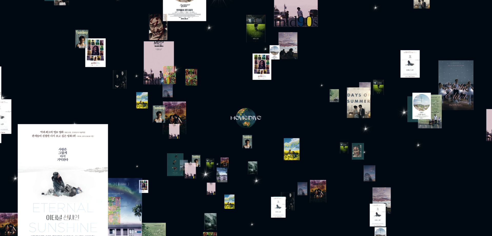
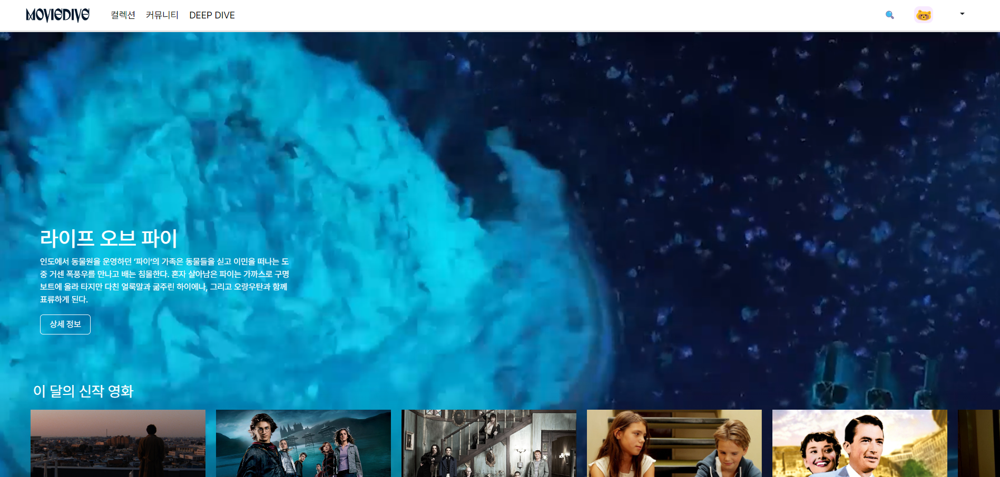
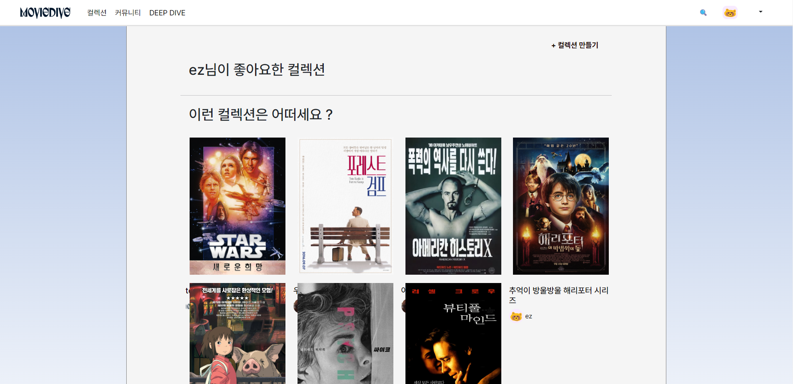
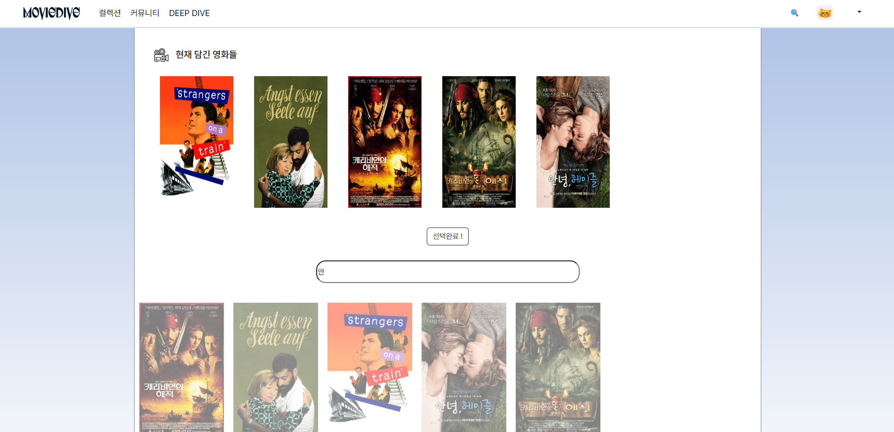
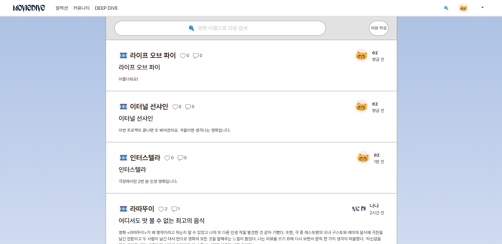
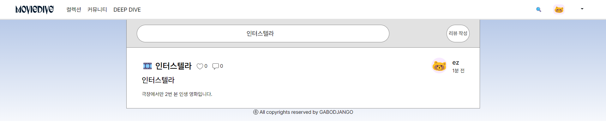
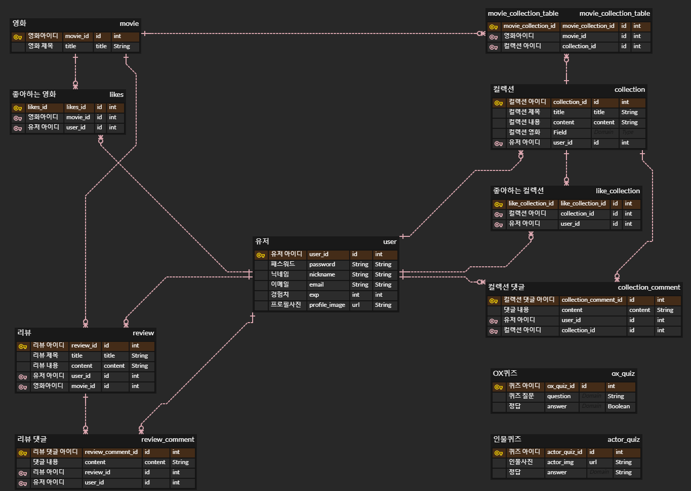

# 8기 FINAL 관통 PJT

### 1. 팀원과 업무 분담

#### 🤍 팀장: 김보경

백엔드 전반 + 영화 / 컬렉션 / 계정  

#### 🤍 팀원: 이은지

랜딩 / 커뮤니티 / 딥다이브

### 2.  목표 서비스 구현 수준

#### 랜딩

#### 메인

#### 컬렉션

#### 커뮤니티

#### DEEP DIVE

### 3. 데이터베이스 모델링 ERD

### 4. 영화 추천 알고리즘

##### 아이템 기반 협업 필터링 사용

사용자가 선호한 항목(item)과 사용자에게 추천하는 항목(item)의 유사성을 나타내는 매트릭스를 만들어 사용자의 기호를 예측하는 협력 필터링 방법.

### 5. 서비스 대표 기능

컬렉션 만들기 기능과 인터랙티브 영화 추천 기능

### 6. 배포 서버 URL

moviedive.co.kr

### 7. 후기

#### 김보경 :

처음으로 직접 기획하고 코드를 짜는 프로젝트를 진행하며 생각을 실제로 구현한다는 것이 많이 어렵다는 것을 느꼈다. 배웠던 것들을 복습하는 느낌이라 생각했는데, 프로젝트 생성부터 구현까지 오롯이 혼자만의 실력으로 해내려 하니 처음 보는 에러도 많이 봤다. 하지만 다양한 에러를 많이 겪고 해결해 나가며 개발자로써 한 발짝 나아갔다고 생각한다. 데이터와 추천 알고리즘, 배포 등을 처음 접하며 공부하고 배운 것도 많다. 다음 프로젝트를 위해 12월은 더 열심히 공부해야겠다고 느꼈다. 

#### 이은지